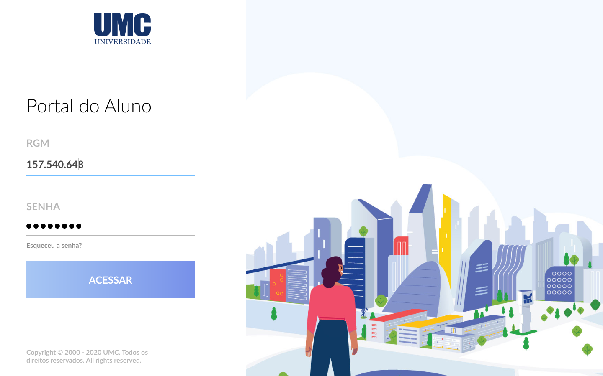

<h2 align="center"> 
	Redesign da tela de login da faculdade UMC ✍️
</h2>

<h1 align="center">
    
</h1>
## 💻 Sobre o projeto

Redesign da tela de login da UMC. Considerando os seguintes fatores: consistência nos espaçamentos, usabilidade, mapa de calor e melhor uso dos tons de cinza.
---

## 🎨 Layout

O layout da aplicação está disponível no Figma:

### Web - Antes e Depois

  

  

---

## 🦸 Autor

<a href="https://github.com/zLeoo">
 
  
 <b>Leonardo dos Santos</b></a> <a href="#" >🚀</a>
  

